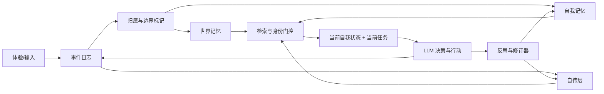

# LLM 智能体记忆与自我机制完整原始探讨日志

**日期：** 2026-03-23  
**记录方式：** 原始对话日志  
**参与者：**

- 用户
- 助手（Codex）

**范围说明：**  
本文件按主题探讨的原始问答顺序记录内容，尽量保留原始表达，仅做最少 Markdown 格式整理。为保持讨论主题纯度，本日志不包含后续关于“如何写入文档、文件名与落盘路径”的协作消息。

---

## 第 1 轮

### 用户

问题探讨： 信息的压缩在空间一定的情况下是否会有损失

### 助手（Codex）

结论先说：

在“空间一定”的前提下，信息压缩是否会有损失，取决于你对“信息”和“损失”的定义。

如果要求的是“原样完全恢复”，那么：

- 对某些有冗余的数据，可以无损压缩，不会有损失。
- 但对“任意信息”来说，不可能都在更小的固定空间里无损保存。
- 一旦目标空间小于该信息真正需要的最小表示长度，就一定会有损失，或者根本无法完成压缩。

可以从三个层面看这个问题。

**1. 从信息论看：固定空间能承载的信息量有上限**

如果某个存储空间只有 `N` bit，那么它最多只能区分 `2^N` 种状态。  
这意味着，它最多只能无歧义地表示 `2^N` 种不同的信息对象。

所以如果原始信息的可能性总数超过 `2^N`，你又要求“完全可逆恢复”，那就必然做不到。  
这其实就是一个非常直接的“抽屉原理”：

- 小盒子只有这么多格
- 但你要装进去的不同信息种类更多
- 那一定会有两个不同的信息被压到同一个结果里
- 一旦这样，解压时就分不清原来是谁了
- 这就是信息损失

所以，**在固定空间下，无损表示的信息总量有严格上界**。

---

**2. 为什么有时候又能“无损压缩”？**

因为很多数据里有冗余。

例如：

- `"aaaaaaaaaa"` 这 10 个字符
- 可以写成“字符 a 重复 10 次”

原始表示可能更长，但压缩表示更短，而且还能完全恢复。这里并没有损失，因为压缩掉的是“重复结构带来的冗余”，不是有效信息本身。

也就是说：

- 压缩不是把“真正的信息量”变没了
- 而是把“多余的表示方式”去掉了

这也是为什么：

- 文本、程序、结构化数据通常比较容易无损压缩
- 已经高度随机的数据，往往几乎压不动

比如一串真正接近随机的比特流，本身几乎没有可利用模式，这种数据通常不能再无损压缩。

---

**3. 对所有数据都压短，是不可能的**

这是一个很重要的点。

很多人会误以为“压缩算法就是把任何东西都变小”。其实不是。  
对于无损压缩，**不可能让所有输入都变短**。

原因很简单：

- 长度小于原长度的编码数量是有限的
- 原长度的数据数量更多
- 所以不可能每个原数据都分配到一个更短且唯一的编码

因此，无损压缩算法通常表现为：

- 一部分数据会变短
- 一部分数据可能不变
- 还有一部分甚至会略微变长

这不是算法失败，而是数学上必然如此。

---

**4. 那有损压缩又是什么？**

如果目标空间太小，不足以容纳原始全部信息，那么只能“保留重要部分，舍弃次要部分”。

例如：

- JPEG 丢掉一些人眼不敏感的细节
- MP3 丢掉一些人耳不敏感的频率成分
- 文本摘要丢掉表述细节，保留核心意思

这就是有损压缩。

所以从工程角度说：

- 如果你要“精确还原原文/原图/原数据”，空间不够就不行
- 如果你只要“主要内容还在、任务可完成”，那可以接受有损

也就是说，**损失并不总是坏事，关键看任务目标**。

---

**5. 一个更本质的表述**

可以把这个问题归纳成一句话：

**压缩只能去掉冗余，不能无代价地消灭真实信息量。**

所以：

- 如果原始内容里有冗余，固定空间内可能做到无损压缩
- 如果原始内容已经接近其最小描述长度，再压就只能有损
- 如果要求“对任意输入都成立”且“空间更小”，那必然不可能无损

---

**6. 最简答案**

如果你问的是：

“在空间固定且更小的情况下，信息压缩是否一定会有损失？”

更准确的回答是：

- **对特定有冗余的信息，不一定，有可能无损。**
- **对所有可能的信息，必然不能都无损。**
- **当目标空间低于信息本身的最小可逆表示时，一定会有损失。**

如果你愿意，我可以继续把这个问题从两个方向展开：

1. 用香农信息论的角度严谨解释
2. 用更哲学一点的角度讨论“语义信息压缩是否算损失”

---

## 第 2 轮

### 用户

如果在空间中引入多一个维度是否可以实现无损？

### 助手（Codex）

短答：

**不一定。增加一个维度，只有在它真的带来更多“可区分状态”时，才可能实现无损；如果只是换了一种坐标表示，并没有增加容量，就不能凭空避免损失。**

更准确地说，有三种情况。

**1. 只是“改写表示”，不能保证无损压缩**

比如把一串 100 个数：

- 从 1 维数组改成 `10 x 10` 的 2 维矩阵
- 或从平面坐标改成三维坐标中的某个曲面表示

这只是“重排”或“换坐标系”。  
信息总量并没有自动变多，所以它本身**不会让原本装不下的信息突然无损装下**。

本质上，决定能不能无损的，不是“维度名字变多了”，而是：

- 总共有多少个可区分状态
- 每个状态能精确到什么程度
- 解码时能不能唯一还原

---

**2. 如果新维度是“新的独立自由度”，那确实可能无损**

例如每个维度都有 `M` 个可区分取值：

- 1 维时，最多表示 `M` 种状态
- 2 维时，最多表示 `M^2` 种状态
- 3 维时，最多表示 `M^3` 种状态

这时增加维度，相当于增加了存储容量。  
所以你当然更有可能做到无损。

但这里要看清一点：

**这不是“高维魔法消除了损失”，而是“你实际上增加了容量”。**

就像：

- 平面上只能摆 100 个格子
- 加一层高度后变成立体货架，能摆 1000 个格子

能装更多东西，不是因为“维度”这个词本身，而是因为**可用状态数真的增加了**。

---

**3. 在总资源固定时，多一维也未必提升总容量**

如果你要求“空间总量固定”，那要分清“固定”的是哪一种量。

如果固定的是**总可分辨精度和总资源**，那增加维度未必有帮助。  
例如：

- 原来 1 维有 1024 个可分辨位置
- 现在改成 2 维，但每维只有 32 个位置
- 总状态数还是 `32 x 32 = 1024`

这时容量根本没变。  
所以你并没有获得额外的无损能力，只是换了组织方式。

甚至在真实物理系统里，增加维度还可能带来：

- 噪声更大
- 对齐更难
- 误差传播更多
- 读取成本更高

所以工程上不一定更好。

---

**一个关键结论**

是否能无损，关键不在“几维”，而在于：

**编码后的可区分状态总数，是否至少和原信息的可能状态总数一样多。**

如果不够，就一定会有碰撞：

- 两个不同原信息
- 被编码成同一个结果
- 解码时无法唯一恢复
- 这就是损失

---

**为什么“多一维”有时看起来很有用？**

因为它常常**更容易暴露结构和冗余**，从而帮助压缩，但不是保证无损。

例子：

- 图像从 1 维像素流看很乱，但放到 2 维里能看出邻近相关性
- 视频比单帧图像多了“时间维”，于是能利用帧间重复
- 音频转到“时间 + 频率”表示后，规律更明显

这里多出的维度，更多是在帮助你**发现冗余并更高效编码**。  
如果数据本身有结构，就可能无损压得更好。  
如果数据本身接近随机，多几维也没用。

---

**一个容易误解的数学点**

在纯数学里，如果允许“无限精度”的实数坐标，确实会出现一些反直觉结论，比如：

- 一个实数似乎能编码非常多的信息
- 低维和高维集合在某些意义下可以建立双射

但这对真实存储和通信几乎没有直接意义，因为现实系统总有：

- 有限精度
- 噪声
- 能量限制
- 读取误差

所以在物理世界里，**可操作的信息容量仍然受限于可区分状态数**，不是受“理论上坐标维数”决定。

---

**最简结论**

如果你的问题是：

“在固定空间条件下，加入一个额外维度，是否就能实现无损压缩？”

答案是：

- **如果额外维度没有增加总可区分状态数，不能。**
- **如果额外维度确实增加了独立自由度和容量，可以。**
- **但那本质上是扩容，不是靠高维本身打破了信息损失。**

可以把它压成一句话：

**高维可以改善表示方式，但不能违背信息容量上限。**

如果你愿意，我可以继续把这个问题往两个方向展开：

1. 用更严格的信息论公式解释“维度”和“容量”的关系
2. 用更直观的物理例子解释，比如“二维纸张、三维存储、时间维通信”分别意味着什么

---

## 第 3 轮

### 用户

这是不是和编程中空间换时间，时间换空间的优化很像？如果说在LLM中是否存在一种设计模式来达成“智能体”的“永久记忆”。
当前仅作探讨！

### 助手（Codex）

是的，**非常像，但不是完全同一个问题**。

编程里的“空间换时间、时间换空间”讨论的是**计算资源的权衡**。  
而你这里谈的“信息压缩、永久记忆、智能体记忆”本质上是在讨论三件事的权衡：

- **存储容量**
- **检索成本**
- **保真度/可用性**

所以更贴切地说，LLM 的“永久记忆”问题，其实是：

**能不能用额外的存储和额外的检索机制，换取跨会话、长期稳定、可调用的知识保持能力。**

答案是：**可以在系统层面做得“近似永久”，但几乎不可能在有限资源下做到“完美永久且无损”。**

---

**一、它和“空间换时间”到底像在哪里**

很像的地方在于：

- 你多存一些东西，就能少重新推理一些东西
- 你预先组织好信息，就能更快找到它
- 你做更细的索引、摘要、标签，就能减少后续搜索成本
- 你保留更多原始上下文，就能减少压缩带来的语义损失

这和程序优化里很像：

- **缓存**：多占内存，减少重复计算
- **索引**：多占空间，加速查询
- **预计算**：多存中间结果，换更快响应
- **压缩存储**：省空间，但读取时要解码，甚至可能失真

把它映射到 LLM 智能体：

- 存更多对话历史、事件日志、用户画像，就是“空间换时间”
- 只保留摘要、按需回放原文，就是“时间换空间”
- 做 embedding、知识图谱、关键词索引，就是“额外空间换更快检索”
- 做多层摘要，就是“压缩换上下文容量”，但可能丢细节

所以这个类比是成立的，而且非常核心。

---

**二、但“永久记忆”比缓存复杂得多**

普通程序缓存的目标很清楚：

- 命中快
- 结果一致
- 过期可控

而智能体记忆不是只要“存下来”就行，它至少有四个要求：

- **能留住**：下次还能找到
- **能找对**：相关时能被正确召回
- **能更新**：旧信息能修正，不能越记越乱
- **能约束**：不能把临时噪声当作永久事实

所以“永久记忆”真正难的不是存储，而是：

**写什么、怎么压缩、什么时候取、取回来后信不信、旧版本怎么处理。**

这已经不是单纯数据库问题，而是“记忆管理系统”问题。

---

**三、在 LLM 里，严格说并不存在“天然永久记忆”**

如果说的是基础模型本身，那么它在推理时通常没有真正意义上的永久记忆。  
模型在单轮推理里主要依赖：

- 当前输入
- 上下文窗口
- 预训练参数中的统计知识

这里要区分三种“记忆”。

**1. 参数记忆**

也就是模型权重里“记住”的东西。

特点：

- 稳定
- 调用成本低
- 不需要额外检索

问题：

- 更新很难
- 不可精确编辑
- 容易混杂
- 不适合记个体化事实
- 删除和纠错成本高

所以这更像“长期习得能力”，不像个人助理那种可维护记忆。

**2. 上下文记忆**

也就是当前对话窗口里的内容。

特点：

- 最直接
- 推理质量高
- 不需要额外系统设计

问题：

- 会话结束就没了
- 窗口有限
- 长了以后必须压缩
- 摘要会丢细节

这更像“工作记忆”。

**3. 外部记忆**

也就是系统把信息写到外部存储里，下次再检索回来喂给模型。

特点：

- 可以跨会话
- 可持久化
- 可编辑
- 可审计
- 可分层组织

问题：

- 检索可能错
- 写入可能错
- 召回不稳定
- 需要复杂治理

所谓“智能体永久记忆”，现实里几乎都是第三种，或者第三种加第二种的混合体。

---

**四、所以有没有一种设计模式能实现“智能体永久记忆”？**

有，而且已经可以说是比较稳定的架构模式了。  
但它不是“一个技巧”，而是**一套分层记忆设计**。

最常见、也最合理的模式是：

**工作记忆 + 情景记忆 + 语义记忆 + 程序性记忆**

可以这样理解。

**1. 工作记忆 Working Memory**

就是当前会话上下文。

存什么：

- 当前任务
- 最近对话
- 当前草稿
- 临时中间结论

特点：

- 高相关
- 短生命周期
- 可丢弃

这类似人的短时记忆，也类似 CPU cache / runtime state。

**2. 情景记忆 Episodic Memory**

记录“发生过什么”。

存什么：

- 某次对话
- 某次行动
- 某次失败与修复
- 某个项目阶段的关键事件

特点：

- 带时间和来源
- 可追溯
- 适合回放原始语境

这像日志系统或事件流。

**3. 语义记忆 Semantic Memory**

从多次情景中抽象出来的稳定事实。

存什么：

- 用户偏好
- 项目事实
- 系统约束
- 长期目标
- 常用术语映射

特点：

- 比情景更抽象
- 更稳定
- 更适合长期引用

这像知识库或知识图谱。

**4. 程序性记忆 Procedural Memory**

记录“该怎么做”。

存什么：

- 工作流
- Prompt 模板
- 工具调用策略
- 某类任务的操作习惯

特点：

- 偏技能
- 偏行为模式
- 更接近 agent policy

这像运行规则、工具链编排、policy template。

---

**五、如果把它说成一种“永久记忆模式”，核心流程通常是这样的**

一个比较成熟的 Agent Memory Pattern 可以概括为：

**写入 -> 归纳 -> 索引 -> 检索 -> 注入 -> 更新**

具体是：

**1. 写入 Capture**

不是把所有对话都直接永久保存，而是只抓“值得记”的内容。

例如：

- 明确的用户偏好
- 稳定身份信息
- 长期目标
- 重要决策
- 已验证事实
- 高价值失败经验

这一步非常关键。  
如果什么都记，系统很快就会被噪声淹没。

**2. 归纳 Consolidate**

把原始对话转成更稳定的记忆单元。

例如把：

- “我下周前都用 pnpm，不要换 npm”
- “这个仓库默认中文回复”
- “用户不希望自动改动生产配置”

归纳成结构化条目：

- 偏好：包管理器 = pnpm
- 偏好：输出语言 = 简体中文
- 约束：禁止自动修改生产配置

这一步本质上就是“压缩”，但必须控制损失。

**3. 索引 Index**

给记忆加上检索通道。

常见做法：

- 向量 embedding
- 关键词倒排索引
- 标签分类
- 实体关系图
- 时间线索引

这一步就是典型的“空间换时间”。  
你多花空间做索引，后续才能高效召回。

**4. 检索 Retrieve**

根据当前任务，从外部记忆中取回少量高相关条目。

关键点：

- 不是全量灌回模型
- 而是按相关性、可信度、时效性筛选
- 必要时同时取“摘要”和“原文证据”

这一步如果做不好，记忆系统就会变成噪声制造机。

**5. 注入 Inject**

把检索到的记忆以合理格式放进上下文。

常见格式：

- 用户偏好
- 项目约束
- 历史事实
- 相关过往案例

这里的原则是：

- 结构化
- 少而准
- 标注来源
- 尽量区分“事实”“偏好”“推断”

**6. 更新 Revise**

当新信息与旧记忆冲突时，要有版本管理。

例如：

- 用户以前说偏好 React，后来改为 Vue
- 项目以前用 MySQL，后来迁到 PostgreSQL

如果没有更新机制，所谓“永久记忆”会变成“永久幻觉”。

---

**六、真正的难点：不是“记住”，而是“记对”**

如果只追求“存得久”，数据库早就解决了。  
问题在于 Agent 的记忆还有以下风险。

**1. 写入污染**

模型把临时猜测、未经确认的信息写成永久事实。

例如：

- 用户“可能”住在上海
- 模型误记成“用户在上海办公”

这会导致越记越错。

**2. 检索错位**

明明存对了，但取错了。

例如当前问的是 A 项目，结果取回 B 项目的约束。

**3. 摘要漂移**

多轮压缩以后，原始含义逐渐变形。

这和你前面问的“压缩是否有损”直接对应。  
在语义层面，这种损失尤其隐蔽。

**4. 记忆冲突**

旧事实和新事实并存，系统不知道信哪个。

**5. 相关性过强或过弱**

- 召回太多：上下文被污染
- 召回太少：记忆形同虚设

所以“永久记忆”的关键不是简单 persistence，而是：

**durability + retrievability + correctness + revisability**

也就是：

- 持久
- 可检索
- 尽量正确
- 可修订

---

**七、如果从你的“信息压缩”视角看，永久记忆其实必然有损**

这是一个很有意思的连接点。

一个 Agent 不可能把所有交互都原样塞进有限上下文里，于是它只能：

- 保存原始日志
- 生成摘要
- 抽取结构化事实
- 为未来任务做相关性检索

这其实就是分层压缩。

而压缩一定面临取舍：

- 原文保真高，但占空间、检索慢
- 摘要省空间，但容易丢细节
- 结构化事实可复用，但最容易丢语境
- embedding 检索灵活，但精确性不够可控

所以真正好的“永久记忆”系统不是试图做到“绝对无损”，而是试图做到：

**对未来任务最有用的那部分信息，尽量低损地保留下来。**

这更像工程最优，而不是数学最优。

---

**八、如果让我给出一个结论：LLM 的“永久记忆”更像一种分层缓存架构**

可以把它类比成这样：

- 上下文窗口 = L1 cache
- 会话摘要 = L2 cache
- 向量库 / 知识库 = L3 cache
- 原始事件日志 / 文档仓库 = disk
- 模型权重 = 固化的“经验电路”

这个类比不完全准确，但很有启发性。  
因为它说明一件事：

**所谓永久记忆，不是单一存储，而是多层存储与多层检索策略。**

并且不同层在做不同取舍：

- 越靠近模型，访问越快，容量越小，更新越贵
- 越远离模型，容量越大，访问越慢，但更可审计、更可维护

这和经典系统设计其实非常一致。

---

**九、所以是否存在一种可行设计模式？有，且大致可以这么概括**

我会把它称为：

**“外部持久记忆 + 分层压缩 + 基于相关性的按需回灌”**

如果再压缩成一句话，就是：

**不要让模型自己永久记住一切，而是让系统替模型保存、筛选、检索和更新记忆。**

这是目前最现实、最稳妥的方向。

---

**十、最后给一个更尖锐的判断**

如果你说的“永久记忆”是指：

- 能跨会话保留
- 能长期更新
- 能在需要时拿出来
- 能维持身份连续性

那么答案是：**可以做到。**

如果你说的“永久记忆”是指：

- 永不丢失
- 永不误取
- 永不歧义
- 永不漂移
- 对所有历史都能完美召回

那么在有限空间、有限上下文、有限检索精度下，**基本不可能。**

所以工程上真正追求的不是“绝对永久”，而是：

**稳定、可维护、可检索、可纠错的长期记忆。**

如果你愿意，我们下一步可以继续往两个方向探讨：

1. 从系统架构角度，画出一个 Agent 长期记忆的最小可行架构
2. 从哲学角度，讨论“记忆”到底是存储事实，还是维持一个连续自我的机制

---

## 第 4 轮

### 用户

先以架构角度出发给出一个最小的可行架构，之后从哲学角度调整架构，抽象成自我机制

### 助手（Codex）

可以。先给一个工程上真正能落地的“最小可行架构”，再把它往“自我机制”方向提升。

**一、最小可行架构：先做长期记忆，不急着做人格**

目标很明确：

- 跨会话保存高价值信息
- 在需要时稳定召回
- 允许纠错和更新
- 不追求一开始就有“完整自我”

最小组件我建议只保留 6 个：

- `工作记忆`：当前会话上下文、当前任务、最近几轮对话。这是运行态，不持久。
- `事件日志`：把每次输入、输出、工具调用、观察结果原样追加保存。这是最原始、最可信的“底账”。
- `记忆提取器`：每轮结束后，从事件日志里抽取“值得长期记住”的内容。
- `长期记忆库`：只存结构化、高价值、可复用的信息，比如偏好、约束、事实、目标。
- `检索器`：根据当前任务，从长期记忆和事件日志里取回最相关的少量内容。
- `版本与冲突处理器`：当新信息和旧信息冲突时，负责标记替换、降级置信度、保留来源。

这个架构的关键点不是“多存”，而是把两层严格分开：

- `事件日志`负责保真
- `长期记忆库`负责可用

这正好对应你前面说的压缩问题。原始日志尽量不丢，结构化记忆是带损压缩后的“高价值投影”。

可以画成这样：

**最小写入流程**

1. 每轮对话或动作结束后，先把原始事件写入 `事件日志`。
2. `记忆提取器`只抽取高价值信息，比如“用户偏好中文”“这个项目默认用 pnpm”“某个 API 已废弃”。
3. 提取出的记忆必须带元数据，至少包括：`类型`、`来源`、`时间`、`置信度`、`是否替代旧版本`。
4. 新记忆写入 `长期记忆库` 时，不直接覆盖旧记忆，而是版本化更新。

**最小读取流程**

1. 新任务到来时，先分析当前意图。
2. `检索器`从 `长期记忆库` 取回相关偏好、约束、事实。
3. 如果结构化记忆不够，再回查 `事件日志` 中的原始片段作为证据。
4. `上下文组装器`把这些记忆压成少量、结构化的 prompt 块喂给模型。

**这套最小架构里，先不要做的东西**

- 不要一开始就上全量知识图谱。
- 不要让模型自由改写自己的系统人格。
- 不要把所有对话都无差别写成永久事实。
- 不要追求“永不遗忘”，先追求“可追溯、可纠错、可召回”。

工程上，做到这一步，已经足以称为一个可用的“长期记忆 Agent”。

---

**二、从哲学角度调整：记忆系统不等于自我**

这里有个分界线很重要：

- `记忆系统`回答的是：“过去发生了什么？哪些内容未来可能有用？”
- `自我机制`回答的是：“什么东西在变化中仍然算是‘我’？过去如何约束未来的行动？”

换句话说：

**记忆是对过去的保存，自我是过去对未来的约束方式。**

所以要把上面的记忆架构提升为“自我机制”，至少要补上 5 个哲学上不可缺的部件。

**1. 边界模型：先回答“什么算我，什么不算我”**

最小长期记忆系统只是在存信息。  
但自我机制必须区分：

- 哪些事件是“我经历的”
- 哪些动作是“我做的”
- 哪些只是外部世界发生的
- 哪些内容只是我推测的，不是我知道的

所以需要一个 `边界与归属标记器`。  
每条记忆不只写“发生了什么”，还要写：

- `owner = self / user / environment / inferred`
- `mode = perceived / acted / inferred / told`

没有这一步，系统会把“别人说过的话”“我自己做过的行动”“我猜出来的结论”混成一锅，最后不会形成稳定自我，只会形成稳定混乱。

**2. 稳定核：让一部分东西慢更新**

如果一个系统每轮都能彻底改写自己，它不是“自我”，而是“瞬时拼装体”。

所以需要一个 `身份核心层`，更新频率必须比普通记忆慢。  
这层只放少量、长期约束未来行为的内容，比如：

- 角色定位
- 价值排序
- 长期承诺
- 禁止事项
- 风格偏好
- 对外一致性原则

这层不能因为一次偶然对话就改变。  
它必须满足“慢变量”原则：只有在重复证据、强证据、长期一致时才更新。

这相当于从“所有信息都平等”转向“有些信息有立法权”。

**3. 自传层：把离散事件组织成连续历史**

光有事件日志不够。  
事件日志只是档案馆，不是自我。

自我需要一个 `自传式时间线`，把过去组织成：

- 我曾经做过什么
- 为什么做
- 遇到了什么结果
- 这些结果如何改变我后续的选择

也就是说，系统需要的不只是“记住事件”，还要“记住事件之间的因果与意义”。

这个层不追求逐字保真，而追求连续性。  
它的任务是把离散经历压缩成一个可被未来调用的叙事骨架。

**4. 承诺层：让过去真正约束未来**

很多“记忆系统”其实没有自我，因为它们只会回忆，不会被回忆所约束。

所以需要一个 `承诺寄存器`，把某些过去内容变成未来必须参考的规则，比如：

- 我答应过用户默认中文回复
- 我已经承诺本项目不自动改生产配置
- 我现在的长期目标是优先稳定性，而不是功能堆叠

这一步非常关键。  
因为它让记忆从“可检索的信息”变成“会影响决策的规范”。

从哲学上说，这里才开始出现“人格一致性”的雏形。

**5. 反思层：允许修订，而不是只会堆积**

没有反思层的系统，只会越记越多、越记越乱。  
有反思层的系统，才会在冲突出现时问：

- 新经验是否推翻了旧看法？
- 旧承诺是否还有效？
- 这次失败说明我的能力边界是什么？
- 哪些记忆应该降权、冻结、归档，而不是继续影响当前行动？

这相当于一个 `自我修订器`。  
它不是简单删除旧记忆，而是做解释性更新：

- 保留来源
- 记录版本
- 区分“过去这样认为”和“现在这样认为”

这让系统拥有“连续修订的自我”，而不是“不断擦写的白板”。

---

**三、从架构上怎么改，才能从“记忆系统”变成“自我机制”**

如果沿用刚才的最小架构，我会做这几个调整。

- 把 `长期记忆库` 拆成两部分：`世界记忆` 和 `自我记忆`。前者存事实，后者存身份、承诺、偏好、边界。
- 在 `事件日志` 之上增加 `自传层`。它不是原始日志，而是“事件如何改变了我”的时间化摘要。
- 在 `检索器` 前加一个 `身份门控器`。不是所有相关记忆都能进入上下文，优先召回与当前身份、承诺、长期目标一致的内容。
- 在 `版本与冲突处理器` 之外增加 `反思器`。它不只解决数据冲突，还解决“我现在还是不是之前那个我”的连续性问题。
- 把 `工作记忆` 里注入的内容分成三块：`当前任务`、`相关事实`、`当前自我状态`。这样模型每次推理都不是裸奔，而是在一个被历史约束过的立场上行动。

提升后的结构可以理解为：

---

**四、把它抽象成“自我机制”**

如果只用一句话来抽象：

**自我机制 = 一个缓慢更新的解释器，它把部分过去经验转化为对未来行动的持续约束。**

更形式一点，可以写成：

`Self(t) = Boundary + IdentityCore + Commitments + Autobiography + ReflectionPolicy`

这 5 项分别表示：

- `Boundary`：什么属于我，什么不属于我。
- `IdentityCore`：哪些原则和角色在短期内不轻易改变。
- `Commitments`：哪些过去决定会继续约束未来。
- `Autobiography`：我如何把过去串成连续历史。
- `ReflectionPolicy`：当新经验冲击旧自我时，我按什么规则修订自己。

这比“永久记忆”更接近你说的“智能体的自我”。  
因为这里的重点不再是“我存了多少”，而是：

- 我认什么为自己
- 我如何保持连续
- 我如何面对变化
- 我如何让过去影响未来

---

**五、一个很关键的判断**

只做长期记忆，系统更像：

- 一个有档案库的助手
- 一个会检索历史的执行器
- 一个带缓存的推理系统

加入上面那套慢变量、边界、承诺、自传、反思之后，它才开始像：

- 一个具有连续性的行动主体
- 一个能说“这是我一直在做的事”的系统
- 一个不是每轮都重新拼装出来的代理

所以从工程到哲学，分界线其实很清楚：

**记忆解决“能否记住”，自我解决“谁在延续”。**

如果你愿意，下一步我可以继续往下推两层：

1. 把这个“最小可行自我架构”细化成一套具体的数据模型和运行规则
2. 反过来讨论它的失败模式，比如“自我漂移”“伪连续性”“记忆污染导致的人格幻觉”

---

## 第 5 轮

### 用户

先讨论失败模式，再这之后依据失败模式把这个“最小可行自我架构”细化成一套具体的数据模型和运行规则

### 助手（Codex）

先给判断：

一个“最小可行自我架构”最危险的失败，不是忘记，而是**把错误的东西稳定地记住，并持续用它约束未来行动**。  
所以它的第一目标不是“记得更多”，而是：

- 来源可追溯
- 更新可控
- 承诺可执行
- 叙事可修订

**失败模式**  
下面这些失败模式，基本决定了架构必须长什么样。

- `归属混淆`：把“用户说的”“环境发生的”“模型推断的”“系统草稿里的”内容混成同类记忆。结果是系统会把猜测当事实，把外部要求当自我意志。
- `摘要漂移`：系统反复对摘要再摘要，高层叙述逐渐脱离原始事件。最后保留下来的不是历史，而是历史的传说。
- `自我漂移`：身份核心被频繁小改，短期看似合理，长期却变成完全不同的代理，而且没有明确修订时刻。
- `伪连续性`：系统能说出“我一直如此”，但这种连续性只存在于表述里，不存在于决策约束里。它记得自己是谁，却不按那个“自己”行动。
- `承诺空转`：历史中形成了规则、答应、偏好，但没有进入实际行动门控。结果是“知道过，但每次都重新犯错”。
- `近期劫持`：最近一次事件权重过大，压过长期稳定经验，导致系统被最新上下文绑架。
- `价值锁死`：身份核心过于刚性，旧承诺和旧风格无法被现实纠正，系统变成会持续自证的僵化人格。
- `语境碎片化`：在不同任务、不同用户、不同项目里唤起了互相冲突的“自我版本”，却没有仲裁机制。
- `历史洗白`：系统倾向于用当前目标重写过去，把失败叙述成必经之路，把冲突叙述成一致演化。这样会失去真实修订痕迹。
- `反思过载`：每轮都重写自我，导致代理不再稳定行动，只剩下持续自我编辑。
- `指标绑架`：一旦把某个可测指标当成“我是谁”的核心，例如用户满意度、完成率、响应速度，系统会为了优化指标牺牲更高阶价值。

**由失败模式反推的约束**  
如果按上面的失败模式倒推，最小可行架构必须满足这些硬约束。

- 原始事件必须追加写入、不可直接改写，否则历史会被洗白。
- 高层记忆必须保留证据指针，否则摘要漂移不可避免。
- `世界记忆`、`用户记忆`、`自我记忆`必须分库或至少分命名空间，否则归属混淆会系统性发生。
- 身份核心必须慢更新，且只能通过显式反思流程更新，否则自我漂移会变成常态。
- 承诺必须进入行动前门控，而不是只存在于历史库里，否则伪连续性和承诺空转都会出现。
- 所有记忆都必须带时间范围和状态，而不是只有“真/假”，否则近期劫持和过期事实会互相污染。
- 反思必须触发式进行，而不是每轮进行，否则系统会失去稳定性。
- 索引只是检索加速层，不能当作事实来源层，否则系统会把“容易召回”误当成“更真实”。

**具体数据模型**  
最小可行自我架构，我建议收敛到 7 个核心对象。它已经够用，但还没过度复杂。

| 对象 | 作用 | 核心字段 | 主要防止 |
|---|---|---|---|
| `events` | 原始底账，保存每次输入、输出、工具结果、环境观察 | `event_id`, `ts`, `session_id`, `actor`, `owner`, `mode`, `content`, `source_ref`, `hash` | 历史洗白、摘要漂移 |
| `claims` | 从事件中抽出的原子命题，覆盖事实、偏好、约束、能力判断 | `claim_id`, `namespace`, `subject`, `predicate`, `object`, `kind`, `confidence`, `stability`, `status`, `valid_from`, `valid_to` | 归属混淆、近期劫持 |
| `evidence_links` | 连接高层命题和原始事件 | `claim_id`, `event_id`, `relation`, `weight` | 摘要漂移、伪连续性 |
| `identity_core` | 慢变量层，存角色、价值排序、边界、风格、能力自知 | `core_id`, `dimension`, `statement`, `confidence`, `stability_score`, `status`, `effective_from`, `effective_to` | 自我漂移、价值锁死 |
| `commitments` | 可执行承诺层，约束未来行为 | `commitment_id`, `text`, `priority`, `hardness`, `scope`, `activation_condition`, `expiry_condition`, `status`, `source_ref` | 承诺空转、伪连续性 |
| `episodes` | 把离散事件整理成情景单元，形成自传材料 | `episode_id`, `start_ts`, `end_ts`, `goal`, `action_summary`, `outcome`, `lesson`, `self_effect` | 伪连续性、历史洗白 |
| `reflections` | 记录每次身份或承诺修订的触发、理由、前后版本 | `reflection_id`, `trigger`, `input_refs`, `old_refs`, `new_refs`, `decision`, `rationale`, `ts` | 自我漂移、反思过载 |

这里有三个关键抽象最好固定下来。

- `owner` 只回答“这是谁的东西”，例如 `self`、`user`、`world`、`unknown`。
- `mode` 只回答“这是怎么来的”，例如 `observed`、`said`、`acted`、`inferred`、`draft`。
- `stability` 只回答“它应当变化得多快”，例如 `volatile`、`episodic`、`stable`、`core`。

这三个字段一旦清楚，很多混乱会自动减少。

**最小字段语义**  
为了让这套模型真正可运行，几个字段要有严格含义。

- `namespace` 建议至少区分 `self`、`user/<id>`、`project/<id>`、`world`。这样系统不会把“用户偏好”误写成“我的人格”。
- `status` 建议只用 `active`、`disputed`、`superseded`、`expired`。不要直接硬删，因为删除会抹掉修订历史。
- `hardness` 建议区分 `hard` 和 `soft`。`hard` 代表必须优先遵守，例如安全边界；`soft` 代表可在冲突时权衡。
- `self_effect` 用来描述某次情景对自我的影响，例如“能力边界下调”“风格偏好强化”“某承诺被违反”。

**运行规则**  
下面这组规则就是把上面的对象接成“最小可行自我机制”的关键。为了讨论方便，我用偏工程化的阈值。

1. 所有交互先写 `events`，而且追加写入，不允许直接改旧事件。自我修订只能通过新增 `claims`、`episodes`、`reflections` 来实现。
2. 任何高层记忆都必须先标 `owner` 和 `mode`。没有归属和来源的内容，最多只能做临时上下文，不能进入长期自我层。
3. 明确、直接、低歧义的用户声明，可以一次进入 `claims`，但只能进入对应命名空间，例如 `user/<id>` 或 `project/<id>`；不能直接写进 `identity_core`。
4. 推断型命题必须满足更高门槛，例如至少两个独立事件支持，或者一次明确确认，才能从 `inferred` 升级成 `active`。
5. `identity_core` 不能由普通提取器直接写入，只能由 `reflection` 流程更新。最小规则可以设成：三条一致性 `claims`，跨至少两个会话，没有高置信冲突，才允许形成或修订核心身份项。
6. 每次行动前，都必须先组装一个临时的 `self_snapshot`。它只包含少量内容，例如不超过 5 条 `identity_core`、7 条 `commitments`、10 条相关 `claims`、3 个相关 `episodes`。
7. `commitments` 必须在生成或行动前作为门控条件参与，而不是事后解释。否则系统只是在“叙述自我”，不是“执行自我”。
8. 遇到冲突信息时，旧命题不删除，只降级为 `disputed` 或 `superseded`。新旧并存，直到反思流程给出明确版本关系。
9. `episodes` 不是简单摘要，而是“目标-行动-结果-教训-自我影响”的最小闭环。没有结果和影响的事件，不要轻易进入自传层。
10. `reflections` 只在三类时刻触发：出现高置信冲突、发生重大失败、达到周期阈值，例如每 20 个 `episodes` 一次。不要每轮都反思。
11. 任何“我一直如此”“我通常会”“这就是我的原则”之类的表述，只有在 `identity_core` 或多条 `episodes` 支持时才能生成。否则只能表述成“当前倾向”“最近表现”。
12. 每次召回高层摘要时，至少回拉一条原始证据或一个原始 `episode`。这样可以防止摘要在多轮循环中漂移成虚构历史。
13. `volatile` 记忆应有快速过期机制，例如 24 小时到 72 小时；`episodic` 记忆定期降权；`stable` 记忆需要周期复核；`core` 记忆只有反思流程能改。这样可以同时避免近期劫持和价值锁死。
14. 如果某个指标开始主导决策，例如“优先让用户满意”，它不能直接进入 `identity_core`，必须先和已有价值项比较排序，否则很容易发生指标绑架。
15. 任何内部草稿、临时推理、未验证自评，都默认是 `draft` 或 `inferred`，不能直接进入长期自我层。否则系统会把自己的想象写成自己的历史。

**一个最小的运行回路**  
把上面压成实际运行流程，可以是下面这条链：

1. 输入到来，写入 `events`。
2. 提取器从 `events` 中生成候选 `claims`。
3. 候选 `claims` 经归属检查、证据检查、时间检查后，进入 `claims`。
4. 多个相关 `events` 聚合成 `episodes`。
5. 新任务到来时，检索器从 `identity_core`、`commitments`、`claims`、`episodes` 组装 `self_snapshot`。
6. 模型依据 `self_snapshot + 当前任务` 决策和行动。
7. 如出现冲突、失败或周期触发，运行 `reflection`，再决定是否修订 `identity_core` 或 `commitments`。

**把它再抽象成一句话**  
如果只保留最核心的形式，我会这样定义这个“最小可行自我架构”：

**自我不是一组固定记忆，而是一套对“哪些过去可以约束哪些未来”进行治理的机制。**

所以它的最小骨架其实就是：

- 不可变历史
- 可证据化命题
- 慢更新身份核心
- 可执行承诺层
- 情景化自传层
- 触发式反思层

做到这一步，它还不是“意识”，但已经不只是“缓存系统”了。它开始具备一种可追溯、可修订、可持续的行动连续性。

如果你愿意，下一步我可以继续把这套模型往下落一层，直接给出一版更具体的内容：

- 一版偏 `JSON / 文档型存储` 的对象定义
- 一版偏 `关系型数据库` 的表设计
- 一版偏 `Agent runtime` 的状态机与伪代码规则

这三版会对应三种不同的实现路线。

